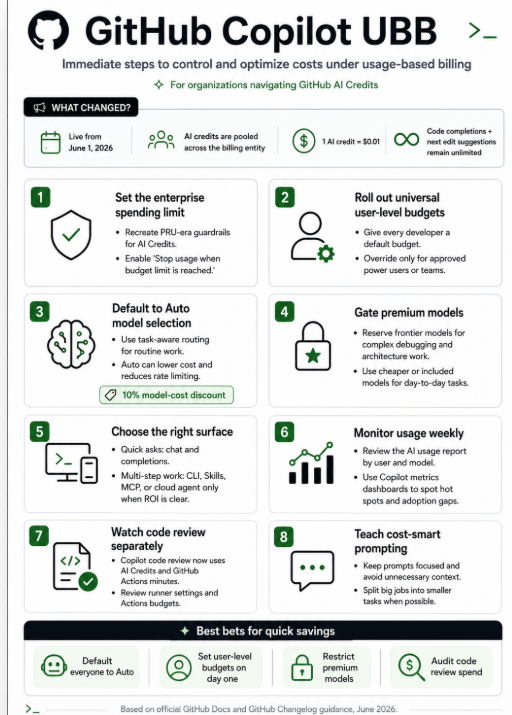
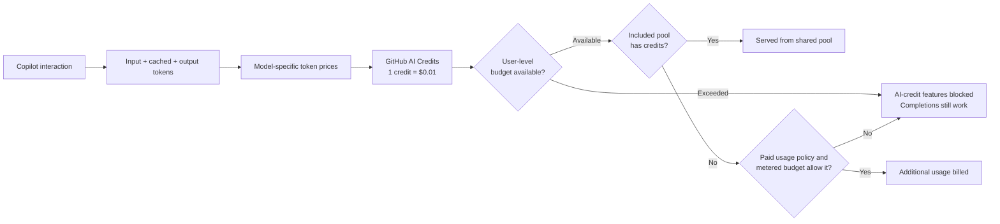
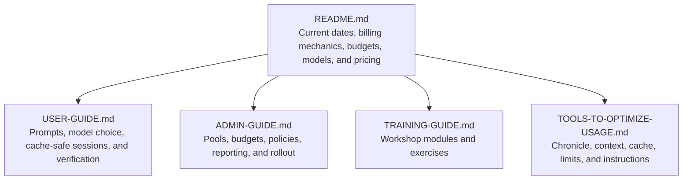

<p align="center">
  
</p>

<h1 align="center">GitHub Copilot Usage-Based Billing</h1>

<p align="center">
  A practical, source-linked field guide for GitHub AI Credits, model pricing,
  budget controls, cost-center pooling, cache efficiency, and Copilot CLI.
</p>

<p align="center">
  
  
  
</p>

> [!IMPORTANT]
> This repository was last checked against GitHub Docs and the GitHub Changelog
> on **July 22, 2026**. Model availability, preview status, prices, and UI
> rollouts can change. Use the linked official pages for a final procurement or
> policy decision.

## Start here

| If you are... | Read this first |
| --- | --- |
| A developer or Copilot user | [User guide](USER-GUIDE.md) |
| An enterprise admin, billing owner, or platform lead | [Admin guide](ADMIN-GUIDE.md) |
| Running a workshop or enablement session | [Training guide](TRAINING-GUIDE.md) |
| Looking for CLI, Chronicle, cache, and context tools | [Tools to optimize usage](TOOLS-TO-OPTIMIZE-USAGE.md) |

## At a glance

| Topic | Current guidance |
| --- | --- |
| Billing unit | **1 GitHub AI Credit = $0.01 USD** |
| Copilot Business | **1,900** included AI credits per assigned user per month |
| Copilot Enterprise | **3,900** included AI credits per assigned user per month |
| Existing-customer promotion | Business: **3,000**; Enterprise: **7,000** per user per month through **September 1, 2026** |
| Pooling | Included credits are pooled at the billing entity level and reset monthly at **00:00 UTC on the first day of the month** |
| Unlimited on paid plans | Code completions and next edit suggestions do not consume AI credits |
| Credit-consuming features | Chat, CLI, cloud agent, Spaces, Spark, code review, and third-party coding agents |
| Auto model selection | Routes at natural cache boundaries and gives paid plans a **10% model-cost discount** on supported surfaces |
| Budget warning | User-level budgets are hard stops; metered budgets require **Stop usage when budget limit is reached** if you want enforcement |
| Legacy exception | Existing annual Copilot Pro and Pro+ subscribers who stayed on request-based billing continue to use premium requests until that legacy plan ends |

Sources: [organization and enterprise UBB](https://docs.github.com/en/copilot/concepts/billing/usage-based-billing-for-organizations-and-enterprises),
[budget controls](https://docs.github.com/en/copilot/concepts/billing/budgets-for-usage-based-billing),
and [auto model selection](https://docs.github.com/en/copilot/concepts/models/auto-model-selection).

## Announcement timeline

| Date | What changed | Why it matters |
| --- | --- | --- |
| **June 1, 2026** | [Usage-based billing broadly became active](https://github.blog/changelog/2026-06-01-updates-to-github-copilot-billing-and-plans/). User-level budgets became GA, and code review on private repositories began consuming Actions minutes in addition to AI credits. | Teams moved from premium-request accounting to token-priced AI credits and needed both AI and Actions guardrails. Existing annual Pro and Pro+ subscribers could remain on legacy request-based billing. |
| **June 2, 2026** | [MAI-Code-1-Flash began rolling out](https://github.blog/changelog/2026-06-02-mai-code-1-flash-is-now-available-for-github-copilot/) to Free, Student, Pro, Pro+, and Max, starting in VS Code. | Microsoft's first purpose-built Copilot coding model added a fast, small-tier option for routine coding. |
| **June 2, 2026** | [Chronicle expanded across Copilot sessions](https://github.blog/changelog/2026-06-02-gain-insights-across-your-agent-sessions-with-chronicle/). | `/chronicle` can turn session history into standups, tips, cost analysis, searches, and custom-instruction improvements. |
| **June 11, 2026** | [AI usage reports standardized on `quantity` and `gross_amount`](https://github.blog/changelog/2026-06-11-ai-usage-report-updates/). | Reporting pipelines should stop relying on the preview-only `aic_quantity` and `aic_gross_amount` fields for post-June 1 usage. |
| **June 18, 2026** | [MAI-Code-1-Flash expanded beyond VS Code](https://github.blog/changelog/2026-06-18-mai-code-1-flash-available-on-more-copilot-surfaces/) to CLI, cloud agent, Copilot app, GitHub Chat, Visual Studio, Mobile, JetBrains, Eclipse, and Xcode for individual plans. | Teams could evaluate the model across more development surfaces before the Business and Enterprise release. |
| **June 19, 2026** | [Per-user AI credit totals were added to the Copilot usage metrics API](https://github.blog/changelog/2026-06-19-ai-credits-consumed-per-user-now-in-the-copilot-usage-metrics-api/). | Admins can use daily and 28-day per-user totals for coaching and budget planning. |
| **June 22, 2026** | [Enterprise teams became assignable to cost centers](https://github.blog/changelog/2026-06-22-assign-enterprise-teams-to-cost-centers/). | Enterprise owners can make cost-center membership, budgets, and included-usage controls follow enterprise team membership. |
| **June 26, 2026** | [MAI-Code-1-Flash became GA for Copilot Business and Enterprise](https://github.blog/changelog/2026-06-26-mai-code-1-flash-for-copilot-business-and-copilot-enterprise/). | Plan administrators must enable the model policy before users can select it. |
| **June 30, 2026** | [Cost-center user-level budgets became available through the REST API](https://github.blog/changelog/2026-06-30-per-user-ai-credit-budgets-available-for-cost-centers/). | One per-user limit can follow every member of a cost center. |
| **July 1, 2026** | [Kimi K2.7 Code began rolling out](https://github.blog/changelog/2026-07-01-kimi-k2-7-is-now-available-in-github-copilot/) to Pro, Pro+, and Max. | Kimi became Copilot's first selectable open-weight model and a lower-cost coding option. |
| **July 2, 2026** | [Cost centers gained AI credit pools](https://github.blog/changelog/2026-07-02-cost-centers-now-support-included-usage-caps/). | Enterprises can cap a cost center's draw from the shared included-credit pool. The launch was REST API only. |
| **July 2, 2026** | [Copilot CLI in GitHub Actions gained `GITHUB_TOKEN` authentication](https://github.blog/changelog/2026-07-02-copilot-cli-no-longer-needs-a-personal-access-token-in-github-actions/). | Organization-owned workflow usage is billed directly to the organization, so user-level budgets do not apply; use cost centers and session limits. |
| **July 7, 2026** | [Kimi K2.7 Code became available for Business and Enterprise](https://github.blog/changelog/2026-07-07-kimi-k2-7-now-available-for-copilot-business-and-enterprise/). | It is **off by default** for these plans. Admins must review open-weight model governance and enable its policy. |
| **July 7, 2026** | [Cost-center user-level budgets reached the billing UI](https://github.blog/changelog/2026-07-07-per-user-budgets-for-cost-centers-in-the-billing-ui/). | Enterprise admins no longer need the REST API to create these group-scoped per-user limits. |
| **July 20, 2026** | [Cost-center AI credit pools reached the billing UI](https://github.blog/changelog/2026-07-20-ai-credit-pools-for-cost-centers-in-the-billing-ui/). | Admins can now enable the included-usage cap while creating or editing a cost center. |

> [!NOTE]
> Kimi was correctly described as unavailable to Business and Enterprise on its
> July 1 launch date. That changed on **July 7, 2026**. Preserve both dates when
> explaining the rollout.

## How AI credit billing works



Important pool behavior:

* Included credits do not roll over.
* Adding a license increases the pool immediately.
* Removing or downgrading a license reduces the pool at the next billing cycle.
* A user-level budget can stop a user even while the shared pool still has
  credits.
* There is no automatic fallback to a cheaper model when a budget is exhausted.
* When a user is blocked, completions and next edit suggestions remain available.

## Included AI credits

| Plan | Standard monthly credits per assigned user | Existing-customer promotion through September 1, 2026 |
| --- | ---: | ---: |
| Copilot Business | 1,900 | 3,000 |
| Copilot Enterprise | 3,900 | 7,000 |

Example: 100 Copilot Business licenses normally contribute **190,000** credits
to the shared monthly pool. During the promotion, those same licenses contribute
**300,000** credits.

> [!WARNING]
> The promotional allowance ends on **September 1, 2026**. Reforecast using the
> standard 1,900 and 3,900 credit amounts before September budgets are set.

## Individual plans and the legacy exception

Current monthly allowances for individual paid plans include fixed base credits
plus a variable flex allotment:

| Plan | Base credits | Current flex allotment | Current total |
| --- | ---: | ---: | ---: |
| Copilot Pro | 1,000 | 500 | 1,500 |
| Copilot Pro+ | 3,900 | 3,100 | 7,000 |
| Copilot Max | 10,000 | 10,000 | 20,000 |

Existing annual Copilot Pro and Pro+ subscribers who remained on legacy
request-based billing after June 1 continue to use premium requests and model
multipliers. GitHub notes that these legacy plans do not receive new models and
features. Cache optimization reduces token-priced UBB, but should not be
described as reducing legacy premium-request counts.

The option to purchase additional AI credits is unavailable for subscriptions
purchased through GitHub Mobile on iOS or Android.

## Budget and cost-center controls

The controls are complementary, not interchangeable.

| Control | What it limits | Active during included pool? | Active during paid usage? | Enforcement |
| --- | --- | :---: | :---: | --- |
| Universal user-level budget | Each user's total AI credit use | Yes | Yes | Always a hard stop |
| Cost-center user-level budget | Each cost-center member's total use | Yes | Yes | Always a hard stop; overrides universal |
| Individual user-level budget | One user's total use | Yes | Yes | Always a hard stop; highest precedence |
| Cost-center AI credit pool | A cost center's draw from included credits | Yes | No | Block or continue into allowed paid usage |
| Cost-center budget | A cost center's additional spend | No | Yes | Hard stop only when the stop-usage setting is enabled |
| Organization budget | An organization's additional spend | No | Yes | Hard stop only when the stop-usage setting is enabled |
| Enterprise spending limit | Enterprise-wide additional spend | No | Yes | Hard stop only when the stop-usage setting is enabled |

### The new cost-center AI credit pool

Available from **July 2, 2026**, this included-usage control keeps one cost
center from consuming credits funded by another group's licenses.

* It requires a cost center with at least one user or enterprise team.
* GitHub calculates the cap from the Business and Enterprise licenses assigned
  to that cost center; admins do not enter the credit number manually.
* The cap updates as licenses change.
* It is separate from the cost-center budget: the pool governs included usage,
  while the budget governs paid usage after the enterprise pool is exhausted.
* Configuration launched through the REST API on July 2 and became available in
  the billing UI on **July 20, 2026**.

### Budget precedence

For user-level budgets, the most specific value wins:

```text
Individual user budget
  > Cost-center user-level budget
    > Universal user-level budget
```

> [!CAUTION]
> A $0 user-level budget blocks AI-credit-consuming Copilot features immediately.
> Also, enterprise, organization, and cost-center metered budgets do not enforce
> a hard stop unless **Stop usage when budget limit is reached** is enabled.

## Models and pricing snapshot

The following prices are GitHub's **default-tier rates per 1 million tokens** as
verified on July 22, 2026. Always check the live
[models and pricing page](https://docs.github.com/en/copilot/reference/copilot-billing/models-and-pricing)
before making a cost decision.

### OpenAI

| Model | Status | Category | Input | Cached input | Output |
| --- | --- | --- | ---: | ---: | ---: |
| GPT-5 mini | GA | Lightweight | $0.25 | $0.025 | $2.00 |
| GPT-5.3-Codex | GA | Powerful | $1.75 | $0.175 | $14.00 |
| GPT-5.4 | GA | Versatile | $2.50 | $0.25 | $15.00 |
| GPT-5.4 mini | GA | Lightweight | $0.75 | $0.075 | $4.50 |
| GPT-5.4 nano | GA | Lightweight | $0.20 | $0.02 | $1.25 |
| GPT-5.5 | GA | Powerful | $5.00 | $0.50 | $30.00 |
| GPT-5.6 Luna | GA | Lightweight | $1.00 | $0.10 | $6.00 |
| GPT-5.6 Sol | GA | Powerful | $5.00 | $0.50 | $30.00 |
| GPT-5.6 Terra | GA | Versatile | $2.50 | $0.25 | $15.00 |

### Anthropic

Anthropic models have a separate cache-write price.

| Model | Status | Category | Input | Cached input | Cache write | Output |
| --- | --- | --- | ---: | ---: | ---: | ---: |
| Claude Haiku 4.5 | GA | Versatile | $1.00 | $0.10 | $1.25 | $5.00 |
| Claude Sonnet 4 | GA | Versatile | $3.00 | $0.30 | $3.75 | $15.00 |
| Claude Sonnet 4.5 | GA | Versatile | $3.00 | $0.30 | $3.75 | $15.00 |
| Claude Sonnet 4.6 | GA | Versatile | $3.00 | $0.30 | $3.75 | $15.00 |
| Claude Sonnet 5 | GA | Versatile | $2.00 | $0.20 | $2.50 | $10.00 |
| Claude Opus 4.5 | GA | Powerful | $5.00 | $0.50 | $6.25 | $25.00 |
| Claude Opus 4.6 | GA | Powerful | $5.00 | $0.50 | $6.25 | $25.00 |
| Claude Opus 4.7 | GA | Powerful | $5.00 | $0.50 | $6.25 | $25.00 |
| Claude Opus 4.8 | GA | Powerful | $5.00 | $0.50 | $6.25 | $25.00 |
| Claude Opus 4.8 fast mode (preview) | GA | Powerful | $10.00 | $1.00 | $12.50 | $50.00 |
| Claude Fable 5 | GA | Powerful | $10.00 | $1.00 | $12.50 | $50.00 |

Claude Sonnet 5 promotional pricing is documented through **August 31, 2026**.

### Google, GitHub, Microsoft, and Moonshot AI

| Provider | Model | Status | Category | Input | Cached input | Output |
| --- | --- | --- | --- | ---: | ---: | ---: |
| Google | Gemini 2.5 Pro | GA | Powerful | $1.25 | $0.125 | $10.00 |
| Google | Gemini 3 Flash | Public preview | Lightweight | $0.50 | $0.05 | $3.00 |
| Google | Gemini 3.1 Pro | Public preview | Powerful | $2.00 | $0.20 | $12.00 |
| Google | Gemini 3.5 Flash | GA | Lightweight | $1.50 | $0.15 | $9.00 |
| Google | Gemini 3.6 Flash | GA | Versatile | $1.50 | $0.15 | $7.50 |
| GitHub | Raptor mini | GA | Versatile | $0.25 | $0.025 | $2.00 |
| Microsoft | MAI-Code-1-Flash | GA | Lightweight | $0.75 | $0.075 | $4.50 |
| Moonshot AI | Kimi K2.7 Code | GA | Versatile | $0.95 | $0.19 | $4.00 |

### Long-context rates

Crossing a model's input threshold can materially increase the entire call's
price.

| Model | Long-context threshold | Input | Cached input | Output |
| --- | ---: | ---: | ---: | ---: |
| GPT-5.4 | More than 272K input tokens | $5.00 | $0.50 | $22.50 |
| GPT-5.5 | More than 272K input tokens | $10.00 | $1.00 | $45.00 |
| GPT-5.6 Luna | More than 200K input tokens | $2.00 | $0.20 | $9.00 |
| GPT-5.6 Sol | More than 272K input tokens | $10.00 | $1.00 | $45.00 |
| GPT-5.6 Terra | More than 272K input tokens | $5.00 | $0.50 | $22.50 |
| Gemini 3.1 Pro | More than 200K input tokens | $4.00 | $0.40 | $18.00 |

## Model rollout notes

### MAI-Code-1-Flash

* Announced June 2 for a gradual individual-plan rollout, starting in VS Code.
* Expanded across more Copilot surfaces during June.
* Became GA for Business and Enterprise on June 26.
* Business and Enterprise admins must enable its model policy.
* It is a small-tier model optimized for fast, iterative coding; compare total
  session outcomes, not only its per-token price.

### Kimi K2.7 Code

* Copilot's first selectable open-weight model.
* Hosted by GitHub on Microsoft Azure.
* Began rolling out to Pro, Pro+, and Max on July 1.
* Became available to Business and Enterprise on July 7.
* It is off by default for Business and Enterprise and requires admin enablement.
* GitHub hosts it on US-based Azure infrastructure; prompts and responses are
  not sent to Moonshot AI.
* Admins should review security, compliance, and data-governance requirements
  before enabling any open-weight model.

## Protect the prompt cache

In agentic sessions, Copilot repeatedly sends system instructions, tool
definitions, conversation history, and file context. Reusing cached context is
usually much cheaper than rebuilding it as fresh input.

### Cache-safe habits

| Do | Avoid |
| --- | --- |
| Pick a model and reasoning level before the session starts | Switching models or reasoning effort in the middle of a task |
| Configure the MCP servers and tools you need up front | Enabling or disabling tools repeatedly during one session |
| Use **Auto** so routing occurs at natural cache boundaries | Manual model hopping to chase small quality differences |
| Run `/compact` before a new phase or after returning to a large old session | Rebuilding a huge stale conversation after cache expiry |
| Start `/new` or `/clear` when switching to an unrelated problem | Carrying unrelated work in the same conversation |
| Use `/context` to inspect what is filling the window | Waiting until context is nearly full before narrowing scope |

GitHub documents that changing the model, reasoning effort, context size, or
enabled tool/MCP set can invalidate the cache. Model caches also expire after
inactivity: GitHub lists **24 hours for OpenAI models and 1 hour for most other
models**. After a long break, compact the session or start a focused new one.

See [Optimizing AI usage](https://docs.github.com/en/copilot/tutorials/optimize-ai-usage)
and [Copilot CLI context management](https://docs.github.com/en/copilot/concepts/agents/copilot-cli/context-management).

## Use Auto as the default

Auto model selection:

* evaluates task complexity and model health;
* uses expensive reasoning models only when the task warrants them;
* changes models only at natural cache boundaries, such as a new session or
  after `/compact`;
* routes around busy or degraded models; and
* gives paid plans a **10% discount on model costs** in Copilot Chat, Copilot
  CLI, GitHub Copilot app, and Copilot cloud agent.

Admins still control which models Auto can use through plan and model policies.

## Chronicle in Copilot CLI

Chronicle turns your private Copilot session history into reusable insight.

```text
/chronicle standup last 3 days
/chronicle tips
/chronicle cost tips
/chronicle improve
/chronicle search authentication
```

Use Chronicle to:

* produce standup summaries;
* identify repeated high-token patterns;
* find sessions that should have been split or compacted;
* generate better repository custom instructions; and
* search or resume previous work.

Chronicle does not have a separately published charge. Treat generated
Chronicle insights as normal Copilot CLI model interactions that consume AI
credits.

Local CLI session data is stored under `~/.copilot/session-state/`, with an index
in `~/.copilot/session-store.db`. Sync is private to the user by default. For
Business and Enterprise, an admin must allow the **Store local sessions in the
Cloud** policy before cross-device session syncing is available.

See [About Copilot CLI session data](https://docs.github.com/en/copilot/concepts/agents/copilot-cli/chronicle).

## Additional high-value tips

1. **Set a session credit limit.** In Copilot CLI public preview, use
   `/limits set max-ai-credits NUMBER` or
   `copilot -p "PROMPT" --max-ai-credits NUMBER`. These are soft limits, and
   GitHub recommends values greater than 30 credits for practical sessions.
2. **Separate research, planning, and implementation.** Use a strong reasoning
   model for the plan, then start a focused implementation session with a
   cheaper execution model.
3. **Keep instructions short and grounded.** A concise
   `.github/copilot-instructions.md` or `AGENTS.md` saves repeated orientation,
   while a long generic file consumes context on every run.
4. **Enable only relevant MCP toolsets.** Tool schemas occupy context even when
   no tool is called.
5. **Use deterministic guardrails.** Targeted tests, linting, and security scans
   prevent expensive agent loops built on an incorrect assumption.
6. **Monitor by outcome.** High usage can be healthy when it maps to a migration,
   incident, or complex refactor. Coach repeated broad prompts and unverified
   loops instead of treating every high-usage user as a problem.
7. **Keep clients current.** Older clients can show stale prices, inaccurate
   usage, or outdated terminology. GitHub's June guidance listed minimums such
   as VS Code 1.120 and Copilot CLI 1.0.48; prefer the latest stable release.
8. **Control organization-billed CLI automation.** Copilot CLI can authenticate
   in GitHub Actions with `GITHUB_TOKEN`. Because that usage is billed directly
   to the organization rather than a user, apply cost-center controls and
   `--max-ai-credits` session limits.

## Reporting checklist

* Review the **AI usage** page and billing reports weekly during rollout.
* For reports after June 1, use `quantity` for AI credits and `gross_amount` for
  dollar value.
* Track per-user daily and 28-day credit totals through the usage metrics API.
* Track Copilot code review separately because private-repository reviews
  consume both AI credits and GitHub Actions minutes. Actions minutes remain
  free for public repositories.
* Reforecast standard included credits before the September 1 promotion ends.
* Compare spend with delivery value, retry rate, review time, and task type.

## Repository map



The Markdown files are the maintained source of truth. The PDF in this
repository is a point-in-time training artifact and may lag the live guidance.

## Official sources

* [Models and pricing for GitHub Copilot](https://docs.github.com/en/copilot/reference/copilot-billing/models-and-pricing)
* [Supported AI models](https://docs.github.com/en/copilot/reference/ai-models/supported-models)
* [Usage-based billing for organizations and enterprises](https://docs.github.com/en/copilot/concepts/billing/usage-based-billing-for-organizations-and-enterprises)
* [Budgets for usage-based billing](https://docs.github.com/en/copilot/concepts/billing/budgets-for-usage-based-billing)
* [Optimizing AI usage](https://docs.github.com/en/copilot/tutorials/optimize-ai-usage)
* [Auto model selection](https://docs.github.com/en/copilot/concepts/models/auto-model-selection)
* [Copilot CLI context management](https://docs.github.com/en/copilot/concepts/agents/copilot-cli/context-management)
* [Copilot CLI Chronicle](https://docs.github.com/en/copilot/concepts/agents/copilot-cli/chronicle)
* [Monitoring AI credit usage](https://docs.github.com/en/copilot/how-tos/manage-and-track-spending/monitor-ai-usage)
* [Legacy request-based billing](https://docs.github.com/en/copilot/reference/copilot-billing/request-based-billing-legacy/github-copilot-premium-requests)
