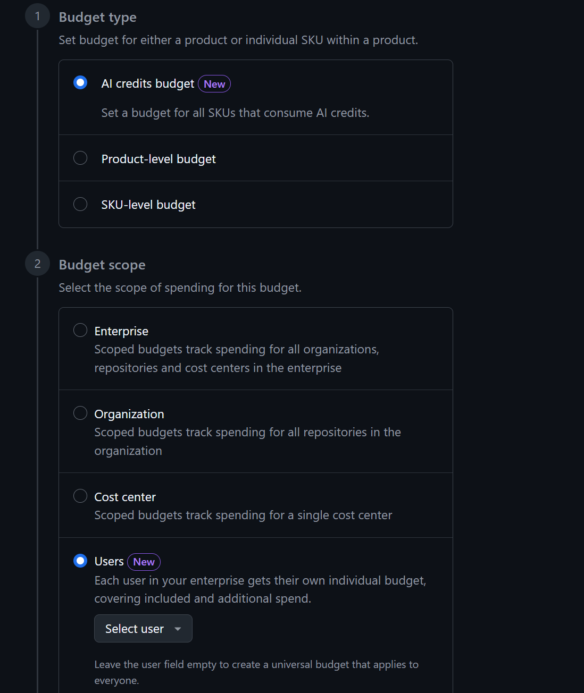
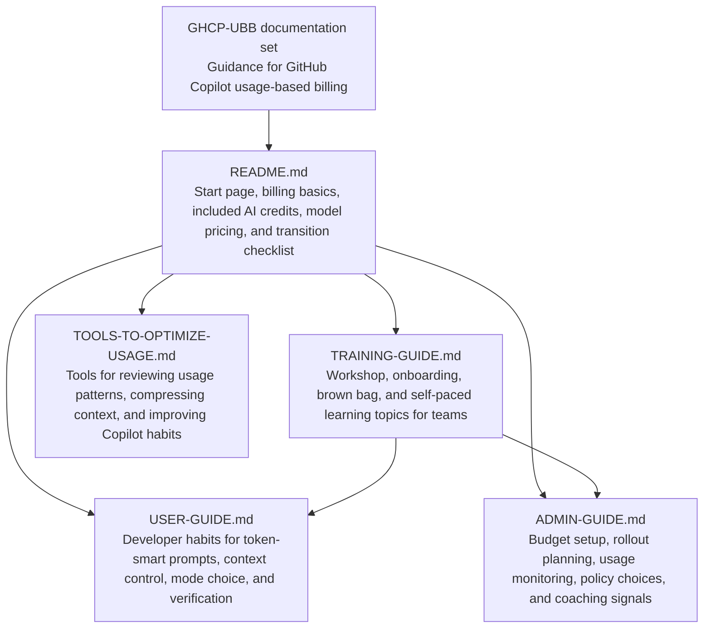

## GitHub Copilot Usage-Based Billing Info and Tips

GitHub Copilot is moving from request-based billing to usage-based billing on
June 1, 2026. This repo helps developers, Copilot users, admins, and billing
owners navigate that transition with practical guidance, budget setup notes, and
tips for using Copilot intentionally.

The goal is not to use Copilot less. The goal is to use Copilot with clearer
intent: choose the right mode, give the right context, verify output quickly, and
avoid expensive loops that do not improve the result.

## Announcements related to UBB

* June 1: UBB goes live. User-level budgeting goes live.

* June 2: Microsoft Build kicks off. Expect new announcements.

## Start Here

Use the guide that matches your role:

| Guide | Best for | What it covers |
| --- | --- | --- |
| [User guide](USER-GUIDE.md) | Developers and Copilot users | Token-smart habits, prompt patterns, context control, mode choice, and verification tips |
| [Admin guide](ADMIN-GUIDE.md) | Admins, billing owners, platform teams, and engineering leads | Budget setup, rollout decisions, usage monitoring, policy choices, and coaching signals |
| [Training guide](TRAINING-GUIDE.md) | Team leads, enablement owners, and facilitators | Topic coverage for workshops, onboarding, brown bags, and self-paced learning |
| [Tools to optimize usage](TOOLS-TO-OPTIMIZE-USAGE.md) | Developers, team leads, and enablement owners | Practical tools for reviewing Copilot usage patterns, compressing context, and reducing low-value token spend |

## Repository map

This README is the shared reference for the billing model, included credits, and
model pricing tables.

Source docs:

* [Models and pricing for GitHub Copilot](https://docs.github.com/en/copilot/reference/copilot-billing/models-and-pricing)
* [Usage-based billing for organizations and enterprises](https://docs.github.com/en/copilot/concepts/billing/usage-based-billing-for-organizations-and-enterprises)

> [!IMPORTANT]
> GitHub says the pricing and billing methods described in the referenced docs
> start on June 1, 2026. Review the live GitHub docs before making billing or
> procurement decisions, because model availability and pricing can change.

## What changes on June 1, 2026

GitHub Copilot Business and Copilot Enterprise usage is measured with GitHub AI
Credits. Copilot interactions consume tokens, including input tokens, output
tokens, and cached tokens. Each model has its own token price, and GitHub
converts the resulting usage into AI credits.

Key facts to remember:

* 1 GitHub AI Credit equals $0.01 USD.
* Copilot Business includes 1,900 AI credits per assigned user per month.
* Copilot Enterprise includes 3,900 AI credits per assigned user per month.
* Existing Business and Enterprise customers receive promotional monthly
  included credits from June 1 through September 1, 2026.
* Included AI credits are pooled at the billing entity level, not held in
  isolated buckets per user.
* Code completions and next edit suggestions are not billed in AI credits for
  paid plans and remain unlimited.
* Copilot Chat, Copilot CLI, Copilot cloud agent, Copilot Spaces, Spark, and
  third-party coding agents consume AI credits.
* After the pooled credits are exhausted, additional usage either continues at
  published rates or is blocked, depending on policy settings.
* User-level budgets can halt a user's Copilot access even when the broader
  organization still has pooled credits available.
* There is no automatic fallback to lower-cost models when a budget is exhausted.

## Included AI credits

| Plan | Standard AI credits per user per month | Promotional credits per user per month, June 1 to September 1, 2026 |
| --- | ---: | ---: |
| Copilot Business | 1,900 | 3,000 |
| Copilot Enterprise | 3,900 | 7,000 |

Example: an organization with 100 Copilot Business users receives a shared pool
of 190,000 standard AI credits per month. During the promotional period, that
same organization receives 300,000 AI credits per month.

## How model pricing works

All prices in the tables below are per 1 million tokens. These are the
usage-based billing rates GitHub lists for June 1, 2026.

A small prompt to a lightweight model can cost a fraction of a credit. A long
agent session using a frontier model across multiple files can cost more because
it consumes more input, output, and cached context.

### OpenAI models

| Model | Release status | Category | Input | Cached input | Output |
| --- | --- | --- | ---: | ---: | ---: |
| GPT-4.1 | GA | Versatile | $2.00 | $0.50 | $8.00 |
| GPT-5 mini | GA | Lightweight | $0.25 | $0.025 | $2.00 |
| GPT-5.2 | GA | Versatile | $1.75 | $0.175 | $14.00 |
| GPT-5.2-Codex | GA | Powerful | $1.75 | $0.175 | $14.00 |
| GPT-5.3-Codex | GA | Powerful | $1.75 | $0.175 | $14.00 |
| GPT-5.4 | GA | Versatile | $2.50 | $0.25 | $15.00 |
| GPT-5.4 mini | GA | Lightweight | $0.75 | $0.075 | $4.50 |
| GPT-5.4 nano | GA | Lightweight | $0.20 | $0.02 | $1.25 |
| GPT-5.5 | GA | Powerful | $5.00 | $0.50 | $30.00 |

GPT-4.1 and GPT-5 mini are included models. GPT-5.4 pricing applies to prompts
with 272K tokens or fewer.

### Anthropic models

Anthropic models include a cache write cost in addition to cached input.

| Model | Release status | Category | Input | Cached input | Cache write | Output |
| --- | --- | --- | ---: | ---: | ---: | ---: |
| Claude Haiku 4.5 | GA | Versatile | $1.00 | $0.10 | $1.25 | $5.00 |
| Claude Sonnet 4 | GA | Versatile | $3.00 | $0.30 | $3.75 | $15.00 |
| Claude Sonnet 4.5 | GA | Versatile | $3.00 | $0.30 | $3.75 | $15.00 |
| Claude Sonnet 4.6 | GA | Versatile | $3.00 | $0.30 | $3.75 | $15.00 |
| Claude Opus 4.5 | GA | Powerful | $5.00 | $0.50 | $6.25 | $25.00 |
| Claude Opus 4.6 | GA | Powerful | $5.00 | $0.50 | $6.25 | $25.00 |
| Claude Opus 4.7 | GA | Powerful | $5.00 | $0.50 | $6.25 | $25.00 |

### Google models

| Model | Release status | Category | Input | Cached input | Output |
| --- | --- | --- | ---: | ---: | ---: |
| Gemini 2.5 Pro | GA | Powerful | $1.25 | $0.125 | $10.00 |
| Gemini 3 Flash | Public preview | Lightweight | $0.50 | $0.05 | $3.00 |
| Gemini 3.1 Pro | Public preview | Powerful | $2.00 | $0.20 | $12.00 |

Gemini 2.5 Pro and Gemini 3.1 Pro pricing applies to prompts with 200K tokens or
fewer. Gemini 3 Flash has no long-context surcharge.

### xAI models

| Model | Release status | Category | Input | Cached input | Output |
| --- | --- | --- | ---: | ---: | ---: |
| Grok Code Fast 1 | GA | Lightweight | $0.20 | $0.02 | $1.50 |

### Fine-tuned GitHub models

| Model | Release status | Category | Input | Cached input | Output |
| --- | --- | --- | ---: | ---: | ---: |
| Raptor mini | Public preview | Versatile | $0.25 | $0.025 | $2.00 |
| Goldeneye | Public preview | Powerful | $1.25 | $0.125 | $10.00 |

Raptor mini uses GPT-5 mini pricing. Goldeneye uses GPT-5.1-Codex pricing.

## Quick Transition Checklist

For users:

1. Start with the narrowest useful prompt and context.
2. Use completions and next edit suggestions freely for local coding flow.
3. Use chat for focused explanations, debugging, and small changes.
4. Use agentic workflows when multi-file autonomy is worth the extra context.
5. Review diffs and run targeted checks before asking Copilot to continue.

For admins:

1. Confirm who owns Copilot billing and budget changes.
2. Decide whether additional usage is allowed after included credits are used.
3. Configure enterprise, organization, cost-center, and user budgets where they
  match your governance model.
4. Start with alerts, observe real usage, then add hard limits where needed.
5. Monitor both AI credit usage and engineering value.

## Repository goals

This repo should help a team answer three questions:

* Which Copilot features should we use for which work?
* How do model and context choices affect AI credit consumption?
* What budgets and habits help us keep high-value Copilot usage available?
